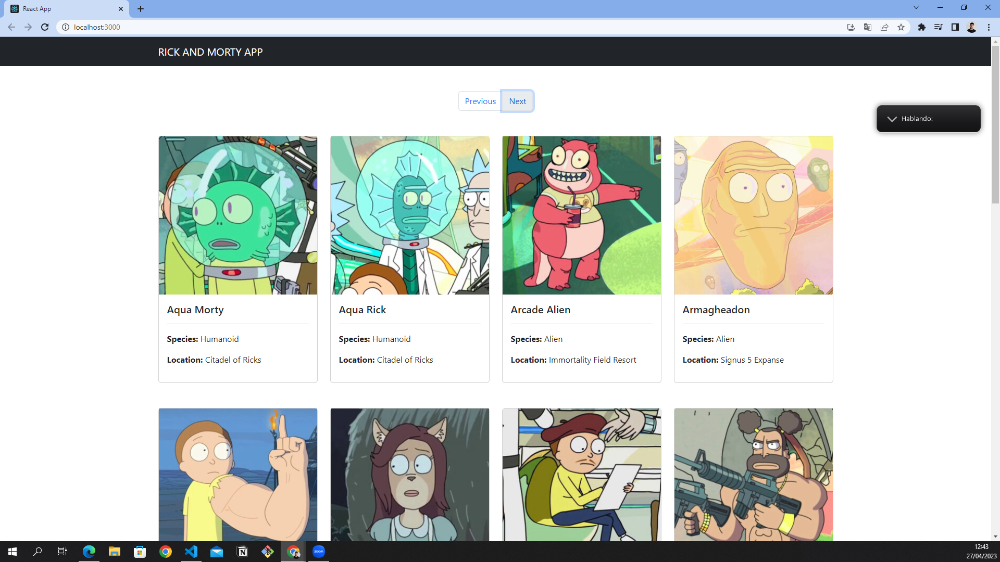

NOMBRE DEL PROYECTO:
-
Práctica de consumo de APIS con React.Js

---
BREVE DESCRIPCIÓN: 
-
En esta práctica he consumido una API de Rick & Morty con React.Js. Contiene una serie de tarjetas con los diferentes personajes de la serie + su info. Al mismo tiempo, la web contiene una paginación con la que puedes ir hacia delante o hacia atrás. He utilizado clases de bootstrap para todo el diseño (las cards, botones, header...) y he organizado el código en base a componentes y hooks. 

---
EL LINK DEL TUTORIAL QUE HE SEGUIDO ES EL SIGUIENTE: 
-
- https://www.youtube.com/watch?v=BTJtTkoyprc

---
LINK DE LA API (PÚBLICA):
-
- https://rickandmortyapi.com/  

---
TECNOLOGÍAS Y FRAMEWORKS QUE HE UTILIZADO
-
- React.Js
- Bootstrap
---

¿CÓMO HE CREADO MI PROYECTO DE REACT?:
-
1: Instalar Node.JS (En su página oficial, la versión LTS)

2: Una vez instalado, vamos a la consola y vamos a la ruta donde queramos crear el proyecto. Ej: cd Desktop

3: Ahora creo el proyecto. Para ello hay que introducir el siguiente comando .npx create-react-app NombreDelProyecto. Ej: npx create-react-app Proyecto1.
Damos enter y el proyecto se debe estar creando. Esperamos un momento hasta que se termine de crear

4: Una vez instalado, entramos a esta carpeta. Para ello usaremos cd NombreDelProyecto. Ej: cd Proyecto1

5: Ahora que ya estamos dentro de esta carpeta, ejecutamos el comando "code ." para abrir nuestro proyecto en el Visual Studio Code

6: Ahora ya deberíamos estar con el VSC abierto con nuestro proyecto base de React. Bien, ahora abrimos la terminal de nuestro VSC y ejecutamos el siguiente comando "npm start".
Al ejecutarlo, se nos abrirá un LocalHost:3000 que es donde se reflejaran todos los cambios que realice en mi código. 

IMPORTANTE: A partir de ahora, nuestros cambios no se verán en LiveServer, sino en el local host que acabamos de abrir.
-
---

EXTENSIONES DE GOOGLE QUE HE INSTALADO PARA FACILITAR EL TRABAJO:
-
* Json Viewer
* React Developer Tools
---
¿CÓMO SE VE LA WEB?
-

